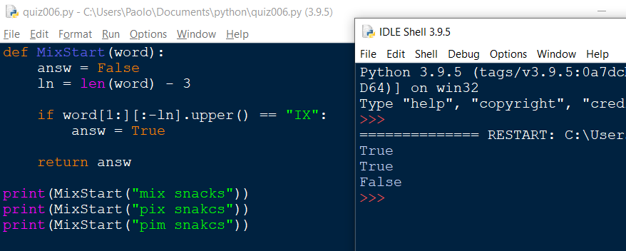

## QUIZ #006

```.py
#Function that returns True if the second and third character are "ix"

def MixStart(word):
    answ = False
    ln = len(word) - 3
    
    if word[1:][:-ln].upper() == "IX":
        answ = True

    return answ
```

Prove that it works:

