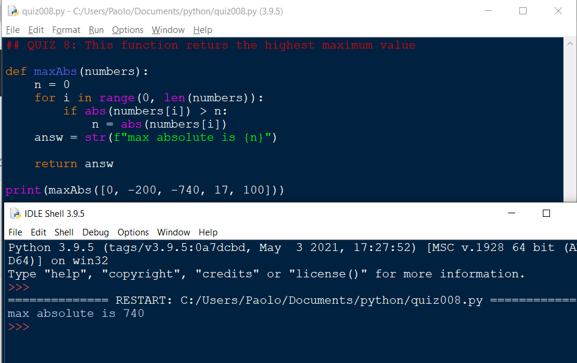

## Quiz #008:

```.py
## QUIZ 8: This function returs the highest maximum value

def maxAbs(numbers):
    n = 0
    for i in range(0, len(numbers)):
        if abs(numbers[i]) > n:
            n = abs(numbers[i])
    answ = str(f"max absolute is {n}")

    return answ

print(maxAbs([0, -200, -740, 17, 100]))
```

Evidence that this works:


